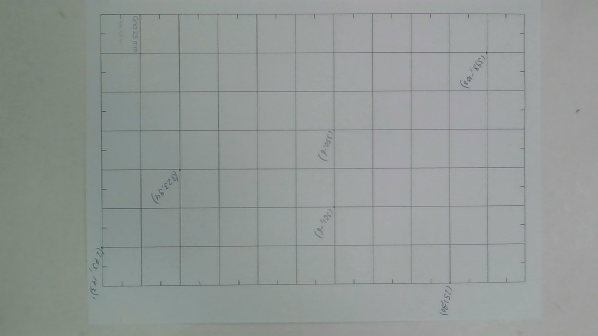
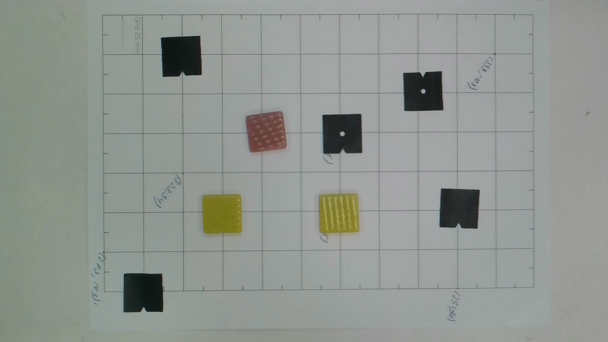
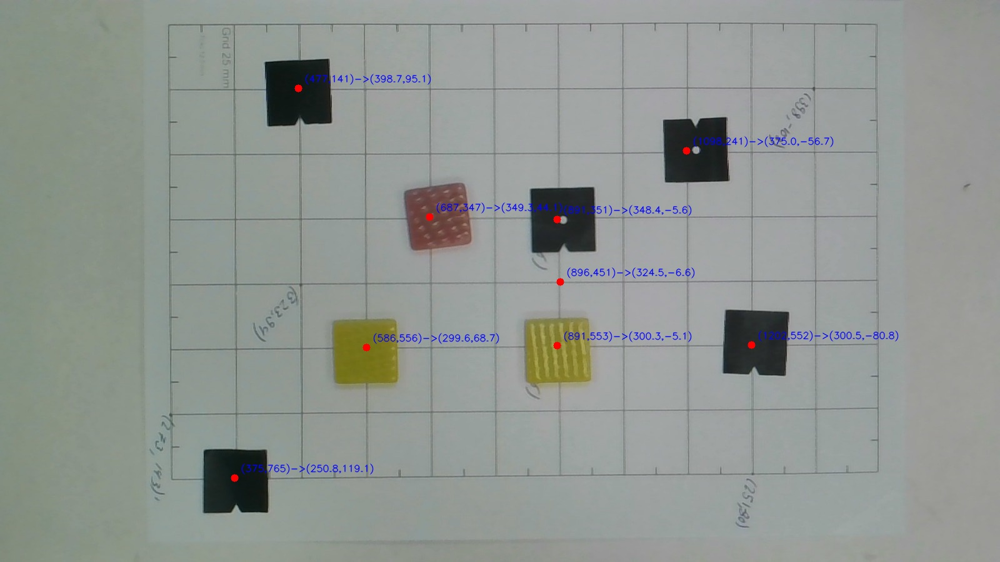

# Machine Vision – Lab Handout  
## Camera–Robot Mapping  

**Course:** Machine Vision  

### Members
- Diwas Kharel  
- Biswash Pokhrel  
- Bikash Basyal  
- Tanvir Ahmed  

---

## Equipment
- Dobot MG400  
- Camera  
- OpenCV (Python)

---

## Introduction  

The objective of this lab was to establish a mapping between image pixel coordinates obtained from a camera and the robot base coordinates of the Dobot MG400 on a flat workplane.

The camera provides coordinates in image space (pixels), while the robot operates in real-world coordinates measured in millimeters (mm). To enable pick-and-place tasks or object interaction, a mathematical transformation between these two coordinate systems must be computed.

---


## calibration image


## Collecting Calibration Points  

To compute the mapping, we manually selected corresponding points:

- Click pixel coordinates from the camera image  (u,v)
- Record robot coordinates from Dobot Studio  (x,y)

The click handling was implemented in `clicks.py` using an OpenCV mouse callback:

```python
def click_event(event, x, y, flags, param):
    if event == cv2.EVENT_LBUTTONDOWN:
        print(f"Clicked pixel coordinates: ({x}, {y})")
        points_img.append((x, y))
```

---

## Calibration Table  

| Point ID | Robot X (mm) | Robot Y (mm) | Pixel (u) | Pixel (v) |
|-----------|--------------|--------------|------------|------------|
| P1 | 350.02 | -6.189  | 894  | 349 |
| P2 | 301.56 | -6.189  | 895  | 553 |
| P3 | 251.34 | -80.11  | 1204 | 758 |
| P4 | 398.58 | -108.1  | 1303 | 141 |
| P5 | 323.20 | 94.713  | 481  | 455 |
| P6 | 273.73 | 143.24  | 272  | 664 |

---

## Homography Computation  

To compute the transformation from image coordinates to robot coordinates, OpenCV’s `cv2.findHomography()` function was used.

```python
H, status = cv2.findHomography(img_pts, robot_pts)
```

### Homography Matrix (H)

```
[[-3.34119531e-03 -2.29350741e-01  4.32340867e+02]
 [-2.44314213e-01  2.34260722e-03  2.11257484e+02]
 [-1.06461903e-05  3.05909716e-05  1.00000000e+00]]
```

---

## Validation  

To validate the calibration:

1. Each calibration pixel point (u, v) was transformed using the homography.
2. The predicted robot coordinates were compared with the actual recorded robot coordinates.

Example validation result:

```
Predicted: 324.05  -6.07  
Actual:    325     -6
```

The error was within a few millimeters, which is acceptable for simple pick-and-place tasks in simulation.

The full code is in `convert_and_validation_check.py` file


---

## Final Testing  

As a final exercise:

- Test objects were placed on the table  
- A new image was captured  
- The mouse click handler was modified to:
  - Display pixel coordinates  
  - Convert them to robot coordinates  
  - Overlay the mapping result directly on the image  

The system successfully converted clicked pixel locations into robot base coordinates in real time.
The full code is in `final_test.py` file

---


###  Image used 




### Result





---
## Conclusion
---

### Challenges Faced 
---


This lab was both challenging and interesting. One major issue we encountered was related to **image resolution mismatch**.

We initially used:

- One image for calibration  
- Another image (with objects) for testing  

However, the two images had different resolutions. When we computed the homography matrix using the first image and applied it to the second image, the mapping failed.

After debugging, we realized:

- The homography matrix is resolution-dependent  
- Changing image size alters pixel coordinates  
- Calibration and testing images must have the **same resolution and camera configuration**

Once the resolution mismatch was corrected, the mapping worked properly.

---

### Learning Outcomes  

From this lab, we learned:

- The difference between image and real-world coordinate systems  
- How to compute planar homography using OpenCV  
- How to use OpenCV mouse callbacks  
- The importance of consistent camera resolution  
- Practical debugging in vision-robot integration  

---

### Overall 

This lab was a valuable practical experience. Collecting robot coordinates was straightforward, but calibrating pixel points and computing the transformation required careful debugging.


The entire process took approximately **6–7 hours**, including resolving the resolution mismatch issue.

Overall, this project strengthened our understanding of:

- Vision-based robot calibration  
- Homography transformations  
- Coordinate system mapping  
- Real-world robotics implementation  

It was a challenging but highly educational experience.
